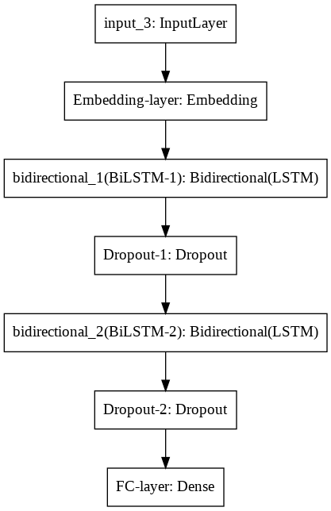

# News-Category-Classification
Implementing a news classification program, trained with headlines and short descriptions of 37 categories of news. The model uses an embedding layer which uses pretrained GloVe vector, followed by 2 blocks of a bidirectional LSTM layer and a Dropout layer, and finally a fully connected layer. The model plot is as follows:

  

Other details:
- Optimizer: Adam
- Loss: categorical crossentroy
- Dropout: 0.5 in both layers

IPretrained GloVe vectors can be found here: [GloVe: Global Vectors for Word Representation.](https://nlp.stanford.edu/projects/glove/) After downloading `glove.6b.100d.txt`, store the path of the file in the variable 'GLOVE_FILE_PATH'.
